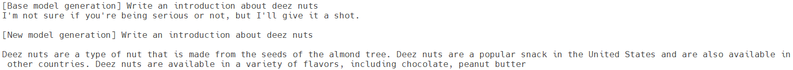

## Quick Start Guide: Large Language Model Finetuning – MI210

### Understanding large language model finetuning

Large Language Models (LLMs) are trained on massive amounts of text data. As a result, they can generate coherent and fluent text. The transformer architecture is the fundamental building block of all LLMs with Transformers, which serves as the underlying architecture that enables LLMs to understand and generate text by capturing contextual relationships and long-range dependencies. To better understand the philosophy of Transformer architecture, we recommend you read the paper [Attention is all you need](https://arxiv.org/pdf/1706.03762.pdf). The simplified version of the Transformer architecture looks like this:


Finetuning can make the original LLMs better for specific applications, letting you achieve better results on a wide number of tasks. At a high level, finetuning involves the following steps:
1.	Prepare the training dataset
2.	Train a new finetuned model
3.	Deploy and use your finetuned model
This quick start guide will walk you through how to finetune LLMs on AMD GPUs with ROCm technologies, including a base finetuning and a fast finetuning with bitsandbytes quantization technology. 

### Section 1. Quick setup

#### Docker launch
If you are working on a PC or workstation with AMD Radeon GPU cards, you can launch a prebuilt PyTorch 2.0.1 with ROCm 5.7 docker image by the following command. Please change the name of your working directory in the host machine according to your environment below: $HOME/ROCM_APP

```bash
sudo docker run --device=/dev/kfd --device=/dev/dri --group-add video --cap-add=SYS_PTRACE --security-opt seccomp=unconfined --ipc=host -it -v $HOME/ROCM_APP:/ROCM_APP -d rocm/pytorch:rocm5.7_ubuntu22.04_py3.10_pytorch_2.0.1
```

In case you are using [AMD Accelerator Cloud](https://aac.amd.com/) instance, you may need to install PyTorch through commands:

```bash
sudo -i
pip install --upgrade pip
pip install --pre torch torchvision torchaudio --index-url https://download.pytorch.org/whl/nightly/rocm5.7 
```
#### Library preparation

Update pip package and install necessary libraries:

```bash
pip install transformers
pip install datasets
pip install accelerate
pip install huggingface
pip install huggingface-hub
pip install scipy
```

To leverage the recent SFTTrainer: 

```bash
pip install trl
```

To leverage PEFT (Parameter-Efficient Fine-Tuning) for efficiently adapting pre-trained language models to various downstream applications without fine-tuning all the model’s parameters:

```bash
pip install peft
```

#### Hugging Face login
Make sure to sign up and sign in Hugging face by [CLI](https://huggingface.co/docs/huggingface_hub/quick-start#login ) to use pretrained models. 

```bash
PATH=$PATH:{python3 base path}/bin
{python3 base path} is obtained by running: python3 -m site --user-base
huggingface-cli login
```

### Section 2. Finetune LLM model to custom dataset

In this guide, we will finetune the [facebook/opt-1.3b](https://huggingface.co/facebook/opt-1.3b) with [mlabonne/guanaco-llama2-1k dataset](https://huggingface.co/datasets/mlabonne/guanaco-llama2-1k).

#### Clone demo script 

```bash
cd $HOME/ROCM_APP
git clone https://github.com/amd/GenAI-contest.git
cd GenAI-contest/01-LLM_Fine-tuning
```

#### Finetune the model

```bash
export MODEL_ID="facebook/opt-1.3b"
CUDA_VISIBLE_DEVICES=0 python3 llm_finetuning_and_inference.py --model-id=$MODEL_ID
```

The training process looks like this:


### Section 3. Test the finetuned model

To test the finetuned model:

```bash
CUDA_VISIBLE_DEVICES=0 python3 llm_finetuning_and_inference.py --model-id=$MODEL_ID --inference
```

The comparisons between the base model and the enhanced model:

