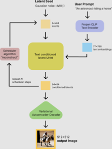
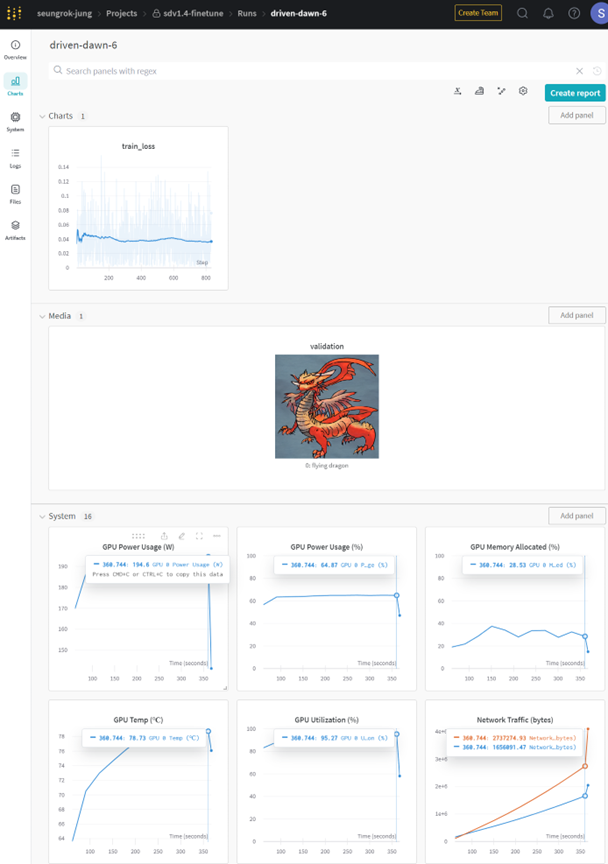
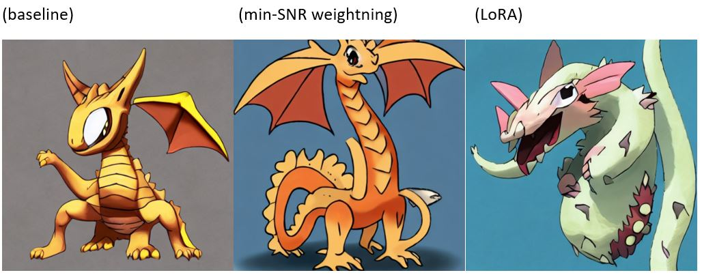

## Quick Start Guide:  Finetuning – MI210

### Understanding Stable Diffusion model finetuning

Stable Diffusion models can generate images from input prompt by using denoising algorithm. To better understand the architecture of common stable diffusion models, we recommend you read this article (https://huggingface.co/blog/stable_diffusion) from hugging face. Stable diffusion models are implemented in the diffusers library (https://github.com/huggingface/diffusers) from hugging face. For the detailed description of the diffusers and finetuning of stable diffusion models, please refer to this README (https://github.com/huggingface/diffusers/tree/main/examples/text_to_image). Finetuning the pretrained stable diffusion models will change the UNET parameters according to the new dataset.



Stable Diffusion finetuning makes the pretrained model to generate images that are more similar to the datasets that were deployed during finetuning. At a high level, finetuning involves the following steps:

1.	Prepare the training dataset
2.	Train a new finetuned model
3.	Deploy and use your finetuned model

This quick start guide will walk you through how to finetune Stable Diffusion on AMD GPUs with ROCm SW stack.

### Section 1. Quick setup

#### Docker launch
If you are working on a PC or workstation with AMD Radeon GPU cards, you can launch a prebuilt PyTorch 2.0.1 with ROCm 5.7 docker image by the following command. Please change the name of your working directory in the host machine according to your environment below: $HOME/ROCM_APP

```bash
sudo docker run --device=/dev/kfd --device=/dev/dri --group-add video --cap-add=SYS_PTRACE --security-opt seccomp=unconfined --ipc=host -it -v $HOME/ROCM_APP:/ROCM_APP -d rocm/pytorch:rocm5.7_ubuntu22.04_py3.10_pytorch_2.0.1
```

In case you are using [AMD Accelerator Cloud](https://aac.amd.com/) instance you can skip this step because you can access the running docker instance with PyTorch and ROCm. 

#### Library preparation

Update pip package and install necessary libraries. You also need to clone the diffusers library from hugging face.

```bash
apt update
apt upgrade -y
python -m pip install --upgrade pip
git clone https://github.com/huggingface/diffusers.git
cd diffusers/
pip install .
cd examples/
cd text_to_image/
pip install -r requirements.txt
pip install wandb
```

#### Huggin Face and Wandb login

Make sure to sign up and sign in hugging face by CLI (https://huggingface.co/docs/huggingface_hub/quick-start#login ) to use pretrained models. Also, do the same for the wandb (https://wandb.ai/site) to use its dashboard to monitor finetuning status.

```bash
huggingface-cli login
wandb login
```

### Section 2. Finetuning Stable Diffusion models to custom datasets

In this guide, we will finetune the stable diffusion v1.4 model (https://huggingface.co/CompVis/stable-diffusion-v1-4) to pokemon dataset (https://huggingface.co/datasets/lambdalabs/pokemon-blip-captions).

#### Clone provided scripts from the demo repo

```bash
cd /ROCM/LLM_GUIDE/git_repo/diffusers/examples/text_to_image
git clone https://github.com/seungrokjung/sd_finetune
mv sd_finetune/* .
```

#### Finetune the model (no quantization)

The provided bash shell script enables you to run 1. Baseline finetuning, 2. min-SNR weightning, 3. LoRA. Refer to the details of each finetuning optimization methods from (https://github.com/huggingface/diffusers/tree/main/examples/text_to_image).

```bash
./sd_finetune.sh
[INFO] Stable diffusion finetuning on AMD Instinct GPUs
Enter target finetuning methods between 0-3
1 baseline
2 min-SNR weightning
3 LoRA
0 run all of 1-3
```

The dataset has 833 images in total and by using batch 1 you need to run 833 steps. To speed up finetuning the model, you can consider increasing the batch size and other options in sd_finetune.sh.

After finetuning the models, you can see the models saved in the current directory like this.

```bash
drwxr-xr-x  2 root root   4096 Oct 16 10:24 sd-pokemon-model_lora/
drwxr-xr-x  9 root root   4096 Oct 16 09:07 sd-pokemon-model_minsnr/
```




### Section 3. Testing the finetuned Stable Diffusion models

To test the finetuned models from the previous section, you can simply run this command.

```bash
./sd_inference_test.sh
[INFO] Baseline Model:  CompVis/stable-diffusion-v1-4
[INFO] Stable diffusion inference test on AMD Instinct GPUs
Enter prompt
a cute dragon
Enter target finetuning methods between 0-3
1 baseline
2 min-SNR weightning
3 LoRA
0 run all of 1-3
```

You can see the generated images from “a cute dragon” input prompt. Note that the images below are not identical not because of the finetuning methods but due to random input seeds.


