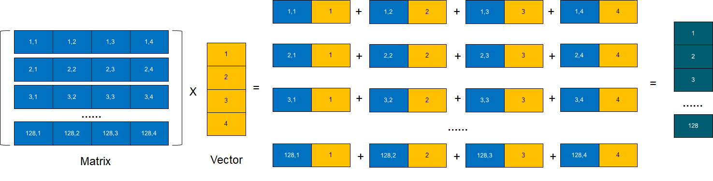
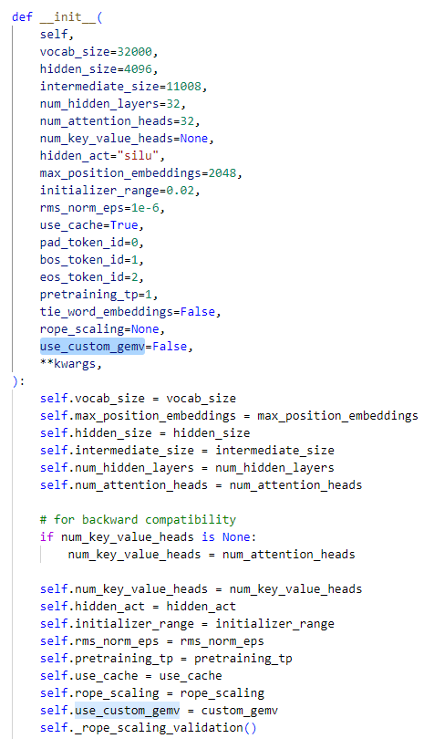
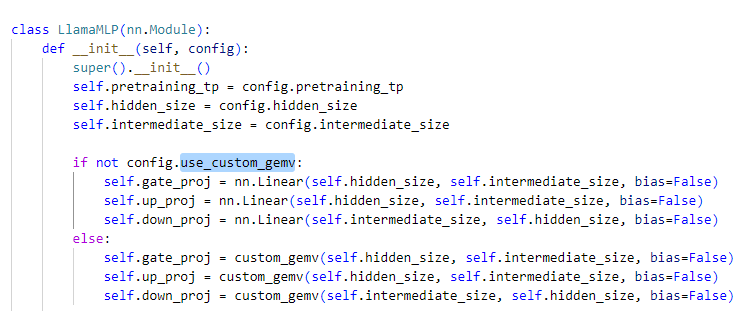

## Quick Start Guide: HIP C++ design, Python binding and transformer model integration - MI210

This is a quick start guide walking through how to write a HIP application to explore AMD GPU compute capability and integrate it to python application as a PyTorch HIP extension for improving the computation performance of Huggingface transformer models. The guide consists 6 parts:

1. Set up a running environment
2. Design a C++ function with HIP kernel to calculate GEMV (General Matrix-Vector multiply)
3. Enable the use of half precision 
4. Enable the use of torch.Tensor  
5. C++ Python binding  
6. Integrate the Python module into Huggingface transformer models

Note that the HIP kernel in this guide is just used as a getting started reference for you to get familar with HIP design, which only performs the basic functionality and is not optimized. It doesn't harness any commonly used GPU tricks, e.g., global memory coalesced access, shared memory cache, etc, for performance improvement. To further improve the generality and efficiency, you need to revamp the kernel based on your application scenarios and the hardware features of the target GPU. Please refer to 'hip_faster_model_inference' to learn optimized kernel design.    

### 1. Set up a running environment
If you are working on a PC or workstation with AMD Radeon GPU cards, you can launch a prebuilt PyTorch 2.0.1 with ROCm 5.7 docker image by the following command. Please change the name of your working directory in the host machine according to your environment below: $HOME/ROCM_APP

```bash
sudo docker run --device=/dev/kfd --device=/dev/dri --group-add video --cap-add=SYS_PTRACE --security-opt seccomp=unconfined --ipc=host -it -v $HOME/ROCM_APP:/ROCM_APP -d rocm/pytorch:rocm5.7_ubuntu22.04_py3.10_pytorch_2.0.1
```

In case you are using [AMD Accelerator Cloud](https://aac.amd.com/) instance you can skip this step because you can access the running docker instance which already has PyTorch and ROCm. 

### 2. Design a C++ function with HIP kernel to calculate GEMV

HIP is a C++ Runtime API and Kernel Language that allows developers to create portable applications for AMD and NVIDIA GPUs from single source code. GEMV is a commonly used operation related to neural networks, arbitrary tensor algebra and other purposes. Given an input matrix (128 x 4) and an input vector (4 x 1), GEMV(matrix, vector) will produce an output matrix of 128 x 1, see the illustration below:



The following steps introduce a simple multi-threaded design and implementation of GEMV using HIP.

#### Prepare C++ source file 

The thread parallelsim philosophy in this case employs 128 threads to compute 128 rows of the input matrix and the vector seperately and correspondingly. The whole application is composed of a C++ function and a HIP GPU kernel function. The C++ function takes matrix, vector and GEMV result as the function arguments, it configures a single thread block with 128 threads, then it launches the HIP GPU kernel with kernel function parameters and the thread block dimension definition. You can either have the two function definitions in a single source file, or you can seperate them into different source files. The kernel file need to be included into the C++ function file if the definition is in another file, i.e., #include "demo_gemv_kernel.h", in this case.

```bash
#include <stdio.h>
#include "demo_gemv_kernel.h"

void demo_gemv_v0(float *mat, float *vec, float *res) {
  
  dim3 grid_dim(1, 1);
  dim3 block_dim(128, 1);

  kernel_gemv_v0<<<grid_dim, block_dim>>>(mat, vec, res);

  hipDeviceSynchronize();
}
```

The HIP kernel function decorated with '__global__' is executed by all threads. The first step is to let threads get their correct data for processing. In this case, threadIdx.x can be used directly as a unique thread ID to index the correct data as a single dimensional thread block size (dim3 block_dim(128, 1)) is declared. If a two or three dimensional block size is declared, then the unique thread ID is normally generated by using threadIdx.x, threadIdx.y and threadIdx.z. Each individual thread gets proper matrix elements (mat_h0/1/2/3) and vector elements (vec_h0/1/2/3), it performs the multiplication and summation before it writes the result back to res. 

#### Prepare HIP kernel file 

```bash
#include <hip/hip_runtime.h>

__global__ void kernel_gemv_v0(float *mat, float *vec, float* res) {
  unsigned int tid = threadIdx.x;
  unsigned int row = tid;
  unsigned int start_idx = 4 * row;
  
  float mat_h0 = mat[start_idx];
  float mat_h1 = mat[start_idx + 1];
  float mat_h2 = mat[start_idx + 2];
  float mat_h3 = mat[start_idx + 3];
  
  float vec_h0 = vec[0];
  float vec_h1 = vec[1];
  float vec_h2 = vec[2];
  float vec_h3 = vec[3];
  
  float sum = 0.0;
  sum += (mat_h0) * (vec_h0);
  sum += (mat_h1) * (vec_h1);
  sum += (mat_h2) * (vec_h2);
  sum += (mat_h3) * (vec_h3);

  res[row] = sum;
}
```

#### Validate the correctness

A main() function is required to validate the correctness of your design, in which you need to allocate memory on both CPU and GPU for input matrix, input vector and output result, fill in some data into elements and call the GEMV function 'demo_gemv_v0' as below.

```bash
int main() {

  int mat_rows = 128;
  int vec_cols = 4;

  // Allocate memory on CPU
  float* mat = (float*)malloc(sizeof(float) * mat_rows * vec_cols);
  float* vec = (float*)malloc(sizeof(float) * vec_cols);
  float* res = (float*)malloc(sizeof(float) * mat_rows);

  // Fill in some data into mat and vec
  for (int i = 0; i < mat_rows * vec_cols; ++i)
    mat[i] = (float)1.f;
  for (int i = 0; i < vec_cols; ++i)
    vec[i] = (float)2.f;
    
  // Allocate memory on GPU
  float *d_mat, *d_vec, *d_res;
  hipMalloc((void **)&d_mat, mat_rows * vec_cols * sizeof(float));
  hipMalloc((void **)&d_vec, vec_cols * sizeof(float));
  hipMalloc((void **)&d_res, mat_rows * sizeof(float));

  // Host to Device
  hipMemcpy(d_mat, mat, (mat_rows * vec_cols) * sizeof(float),hipMemcpyHostToDevice);
  hipMemcpy(d_vec, vec, (vec_cols) * sizeof(float), hipMemcpyHostToDevice);

  // Launch kernel
  demo_gemv_v0(d_mat, d_vec, d_res);

  // Device to Host
  hipMemcpy(res, d_res, (mat_rows) * sizeof(float), hipMemcpyDeviceToHost);

  // Print result
  for(int i = 0; i < mat_rows; ++i)
    printf("%f ", res[i]);
}
```

#### Build and run the executable

```bash
cd /ROCM_APP
git clone https://github.com/chengl-amd/hip_design.git
cd ./hip_design/hip_basics/backend
hipcc --offload-arch=gfx90a demo_gemv_v0.cpp -o gemv_v0
./gemv_v0
```

gfx90a is the target architecture for Instinct MI210，please refer to [LLVM target](https://rocm.docs.amd.com/en/latest/release/gpu_os_support.html) if you want to run the code on other GPU targets.

### 3. Enable the use of half precision 

32-bit single-precision floating point requires considerable compute capability, storage and bandwidth. When half-precision is introduced with deep neural networks, the time needed for training and inference can be reduced. By using half precision as a storage, the memory footprint also can be reduced. To enable HIP kernel to process half-precision GEMV, simply replace 'float' in the previous functions to 'half', and add "#include <hip/hip_fp16.h>" as below.

#### Prepare C++ source file 

```bash
#include <stdio.h>
#include "demo_gemv_kernel.h"

void demo_gemv_v1(half *mat, half *vec, half *res) {

  dim3 grid_dim(1, 1);
  dim3 block_dim(128, 1);

  kernel_gemv_v1<<<grid_dim, block_dim>>>(mat, vec, res);

  hipDeviceSynchronize();
}
```

#### Prepare HIP kernel file

```bash
#include <hip/hip_runtime.h>
#include <hip/hip_fp16.h>

__global__ void kernel_gemv_v1(half *mat, half *vec, half *res) {
  unsigned int tid = threadIdx.x;
  unsigned int row = tid;
  unsigned int start_idx = 4 * row;
  
  half mat_h0 = mat[start_idx];
  half mat_h1 = mat[start_idx + 1];
  half mat_h2 = mat[start_idx + 2];
  half mat_h3 = mat[start_idx + 3];
  
  half vec_h0 = vec[0];
  half vec_h1 = vec[1];
  half vec_h2 = vec[2];
  half vec_h3 = vec[3];
  
  float sum = 0.0;
  sum += __half2float(mat_h0) * __half2float(vec_h0);
  sum += __half2float(mat_h1) * __half2float(vec_h1);
  sum += __half2float(mat_h2) * __half2float(vec_h2);
  sum += __half2float(mat_h3) * __half2float(vec_h3);
  
  res[row] = __float2half(sum);
}
```

#### Build and run the executable

```bash
hipcc --offload-arch=gfx90a demo_gemv_v1.cpp -o gemv_v1
./gemv_v1
```

### 4. Enable the use of torch.Tensor 

#### Prepare C++ source file

To power much of PyTorch's backend, we further use ATen library, which is the primary API for tensor computaton. To enable ATen for our application, simply replace all 'half' to 'at::Tensor' in previous demo_gemv_v1 function and include '#include <ATen/ATen.h>', see below: 

```bash
#include <stdio.h>
#include "demo_gemv_kernel.h"
#include <ATen/ATen.h>
#include <torch/extension.h>

void demo_gemv_v2(at::Tensor mat, at::Tensor vec, at::Tensor res) {

  dim3 grid_dim(1, 1);
  dim3 block_dim(128, 1);

  kernel_gemv_v1<<<grid_dim, block_dim>>>
    (
     reinterpret_cast<half *>(mat.data_ptr<at::Half>()),  
     reinterpret_cast<half *>(vec.data_ptr<at::Half>()), 
     reinterpret_cast<half *>(res.data_ptr<at::Half>())
     );
  
  hipDeviceSynchronize();
}
```
### 5. HIP C++ Python binding

#### Prepare header file 'demo_gemv.h' to expose the function name

The general strategy for writing a HIP extension to Python is to have a visiable C++ function at first and then bind the function to Python using pybind11. We need the function 'demo_gemv_v2' to be called from Python:

```bash
#include <ATen/ATen.h>
#include <ATen/hip/HIPContext.h>
void demo_gemv_v2(at::Tensor A, at::Tensor B, at::Tensor C);
```

#### Prepare pybind.cpp

Use pybind11 to create Python binding for our C++ code, where the C++ demo_gemv_v2 function is bound to Python gemv:

```bash
#include <pybind11/pybind11.h>
#include <torch/extension.h>
#include <torch/serialize/tensor.h>

#include "demo_gemv.h"

PYBIND11_MODULE(TORCH_EXTENSION_NAME, m){
  m.def("gemv", &demo_gemv_v2);
}
```

#### Prepare setup.py script to build

The following setup.py script uses setuptools to build the code.

```bash
import os
from setuptools import setup
from torch.utils.cpp_extension import BuildExtension, CppExtension

sources = [
            os.path.join('backend', 'pybind.cpp'),
            os.path.join('backend', 'demo_gemv_v2.cpp'),
        ]

os.environ["CC"] = "hipcc"
os.environ["CXX"] = "hipcc"

setup(
    name='demo',
    version='0.0.1',
    ext_modules=[
        CppExtension('demo.backend',
            sources=sources,
            extra_compile_args = ['-g', '-O3', '-fopenmp', '-lgomp'],
            include_dirs=[],
        ),
    ],
    cmdclass={
        'build_ext': BuildExtension
    })
```

#### Install the extension

```bash
cd hip_design
python setup.py install
```

Successful installation will generate a Python demo package. To check the package's information:

```bash
pip show demo
```

### 6. Integrate the Python module into Huggingface transformer models

#### Install transformers

```bash
pip install transformers
```
#### A example: Making custom GEMV replace native PyTorch nn.Linear

Linear transformation is used frequently in transformer models. In PyTorch, torch.nn.Linear applies the linear transformation to the incoming input and weights. Let's say you have profiled the inference process of a transformer model, e.g., llama, and you want to implement a custom GEMV to replace the native linear transformation in Decoder for the purpose of decreasing token generation latency. To integrate your custom Python module in Huggingface transformer models, you need to revise 'configuration_llama.py' and 'modeling_llama.py' in /opt/conda/envs/py_3.10/lib/python3.10/site-packages/transformers/models/llama/. The former provides configurations to instantiate an llama model according to the specified arguments, defining the model architecture. The latter defines the detailed implementation process, e.g., forward and backward process. 

```bash
cd /opt/conda/envs/py_3.10/lib/python3.10/site-packages/transformers/models/llama/
```

To replace the native PyTorch module, the commonly used method is to add a parameter to the parameter list of the __init__ function at first which plays as a flag to invoke your custom Python module.





Then, you can add a simple if statement to specify a block of code using the custom module if the condition is true after running the model: 



