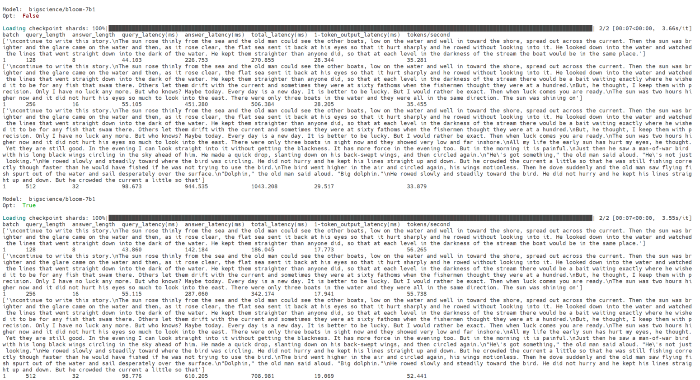

## Quick Start Guide: HIP GEMV kernel for faster transformer model inference - MI210

This is a ready implementation of using an optimized HIP C++ kernel to speedup the inference of 3 Huggingface transformer models: 

1. bigscience/bloom-7b1
2. meta-llama/Llama-2-7b-hf
3. facebook/opt-6.7b

Please refer to 'hip_basics' in the rep to get the basics of HIP C++ design, Python binding and transformer model integration if you are not familiar with these procedures.    				

### 1. Set up a running environment
If you are working on a PC or workstation with AMD Radeon GPU cards, you can launch a prebuilt PyTorch 2.0.1 with ROCm 5.7 docker image by the following command. Please change the name of your working directory in the host machine according to your environment below: $HOME/ROCM_APP

```bash
sudo docker run --device=/dev/kfd --device=/dev/dri --group-add video --cap-add=SYS_PTRACE --security-opt seccomp=unconfined --ipc=host -it -v $HOME/ROCM_APP:/ROCM_APP -d rocm/pytorch:rocm5.7_ubuntu22.04_py3.10_pytorch_2.0.1
```

In case you are using [AMD Accelerator Cloud](https://aac.amd.com/) instance, you may need to install PyTorch through command:
sudo pip3 install --pre torch torchvision torchaudio --index-url https://download.pytorch.org/whl/nightly/rocm5.7 

### 2. Install the basic packages

```bash
pip install pip --upgrade
pip install transformers
```

### 3. Install the optimized package

```bash
cd /ROCM_APP
git clone https://github.com/amd/GenAI-contest.git
cd 03-HIP_LLM_Acceleration/hip_faster_model_inference/eed
sudo python3 setup.py install
```

### 4. Replace model and configuration files in Transformers

```bash
cd ..
cp ./models/bloom/* {your transformers path}/models/bloom/
cp ./models/opt/* {your transformers path}/models/opt/
cp ./models/llama/* {your transformers path}/models/llama/
```

### 5. Run testing script

```bash
python3 run_llm_inference.py
```

The successful running looks like this:




